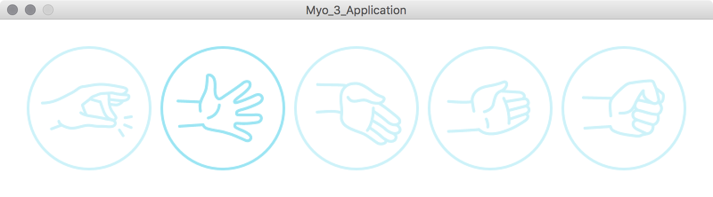

[](https://gitter.im/nok/myo-processing?utm_source=badge&utm_medium=badge&utm_campaign=pr-badge&utm_content=badge) [](https://raw.githubusercontent.com/nok/myo-processing/master/LICENSE)

---


===

Contributed library to use the [Myo](https://www.thalmic.com) in [Processing](http://processing.org/).


## Table of Contents

- [About](#about)
- [Download](#download)
- [Installation](#installation)
- [Dependencies](#dependencies)
- [Tested](#tested)
- [Examples](#examples)
- [Usage](#usage)
- [Questions?](#questions)
- [License](#license)


## About

The [Myo](https://www.thalmic.com) armband lets you use the electrical activity in your muscles to wirelessly control your computer, phone, and other favorite digital technologies. With the wave of your hand, it will transform how you interact with your digital world.


## Download

- [Myo for Processing v0.9.0.2](download/MyoForProcessing.zip?raw=true)


## Installation

Unzip and put the extracted *MyoForProcessing* folder into the libraries directory of your Processing sketches. The References and examples are stored in the *MyoForProcessing* directory. For more help read the [tutorial](http://www.learningprocessing.com/tutorials/libraries/) by [Daniel Shiffman](https://github.com/shiffman).


## Dependencies

- [Myo Connect v0.9.0](https://developer.thalmic.com/downloads)
- [Myo Firmware v1.5.1970](https://developer.thalmic.com/downloads)


## Tested

System:

- **OSX** (*Mac OS X 10.7 and higher - tested with Mac OS X 10.10 Yosemite*)
- **Windows** (*not tested yet, but x86 and x64 should work*) (*Windows 7 and 8*)

Myo SDK version:

- **0.9.0**

Processing version:

- **3.1.1**
- 3.0.2
- 3.0a4


## Examples

- Application → [Myo_1_Application.pde](examples/Myo_1_Application/Myo_1_Application.pde)
- [Callbacks of events](#basics) → [Myo_2_Callbacks.pde](examples/Myo_2_Callbacks/Myo_2_Callbacks.pde)
- EMG data streams → [Myo_3_EMG_Data.pde](examples/Myo_3_EMG_Data/Myo_3_EMG_Data.pde)

Here you see a screenshot of the viewable example [Myo_1_Application.pde](examples/Myo_1_Application/Myo_1_Application.pde):




## Basics

```java
import de.voidplus.myo.*;

Myo myo;

void setup() {
  size(800, 400);
  background(255);
  // ...
  
  myo = new Myo(this);
  // myo = new Myo(this, true); // enable EMG data
}

void draw() {
  background(255);
  // ...
}


// ==========================================================
// Executable commands:

void mousePressed() {
  if (myo.hasDevices()) {
    myo.vibrate();
    myo.requestRssi();
    myo.requestBatteryLevel();
  }
}


// ==========================================================
// Application lifecycle:

void myoOnPair(Device myo, long timestamp) {
  println("Sketch: myoOnPair() has been called"); 
  int deviceId             = myo.getId();
  int deviceBatteryLevel   = myo.getBatteryLevel();
  int deviceRssi           = myo.getRssi();
  String deviceFirmware    = myo.getFirmware();
}
void myoOnUnpair(Device myo, long timestamp) {
  println("Sketch: myoOnUnpair() has been called");
}

void myoOnConnect(Device myo, long timestamp) {
  println("Sketch: myoOnConnect() has been called");
  int deviceId             = myo.getId();
  int deviceBatteryLevel   = myo.getBatteryLevel();
  int deviceRssi           = myo.getRssi();
  String deviceFirmware    = myo.getFirmware();
}
void myoOnDisconnect(Device myo, long timestamp) {
  println("Sketch: myoOnDisconnect() has been called");
}

void myoOnWarmupCompleted(Device myo, long timestamp) {
  println("Sketch: myoOnWarmupCompleted() has been called");
}

void myoOnArmSync(Device myo, long timestamp, Arm arm) {
  println("Sketch: myoOnArmSync() has been called");

  switch (arm.getType()) {
  case LEFT:
    println("Left arm");
    break;
  case RIGHT:
    println("Right arm");
    break;
  default:
    println("Unknown arm");
    break;
  }
}

void myoOnArmUnsync(Device myo, long timestamp) {
  println("Sketch: myoOnArmUnsync()");
}

void myoOnLock(Device myo, long timestamp) {
  println("Sketch: myoOnLock() has been called");
}
  
void myoOnUnLock(Device myo, long timestamp) {
  println("Sketch: myoOnUnLock() has been called");
}


// ----------------------------------------------------------
// Gestures or poses:

void myoOnPose(Device myo, long timestamp, Pose pose) {
  println("Sketch: myoOnPose() has been called");
  switch (pose.getType()) {
    case REST:
      println("Pose: REST");
      break;
    case FIST:
      println("Pose: FIST");
      break;
    case FINGERS_SPREAD:
      println("Pose: FINGERS_SPREAD");
      break;
    case DOUBLE_TAP:
      println("Pose: DOUBLE_TAP");
      break;
    case WAVE_IN:
      println("Pose: WAVE_IN");
      break;
    case WAVE_OUT:
      println("Pose: WAVE_OUT");
      break;
  }
}


// ----------------------------------------------------------
// Additional information:

void myoOnRssi(Device myo, long timestamp, int rssi) {
  println("Sketch: myoOnRssi() has been called, rssi: " + rssi);
}

void myoOnBatteryLevelReceived(Device myo, long timestamp, int batteryLevel) {
  println("Sketch: myoOnBatteryLevel() has been called, batteryLevel: " + batteryLevel);
}


// ----------------------------------------------------------
// Data streams:

void myoOnOrientationData(Device myo, long timestamp, PVector orientation) {
  // println("Sketch: myoOnOrientationData() has been called");
}

void myoOnAccelerometerData(Device myo, long timestamp, PVector accelerometer) {
  // println("Sketch: myoOnAccelerometerData() has been called");
}

void myoOnGyroscopeData(Device myo, long timestamp, PVector gyroscope) {
  // println("Sketch: myoOnGyroscopeData() has been called");
}

void myoOnEmgData(Device myo, long timestamp, int[] data) {
  // println("Sketch: myoOnEmgData() has been called");
}


// ==========================================================
// Alternatively you can use a global callback:

void myoOn(Myo.Event event, Device myo, long timestamp) {  
  switch(event) {
  case PAIR:
    // println("Sketch: myoOn() of type 'PAIR' has been called");
    break;
  case UNPAIR:
    // println("Sketch: myoOn() of type 'UNPAIR' has been called");
    break;
  case CONNECT:
    // println("Sketch: myoOn() of type 'CONNECT' has been called");
    String firmware = myo.getFirmware();
    int deviceId = myo.getId();
    break;
  case DISCONNECT:
    // println("Sketch: myoOn() of type 'DISCONNECT' has been called");
    break;
  case ARM_SYNC:
    // println("Sketch: myoOn() of type 'ARM_SYNC' has been called");
    break;
  case ARM_UNSYNC:
    // println("Sketch: myoOn() of type 'ARM_UNSYNC' has been called");
    break;
  case WARMUP_COMPLETED:
    // println("Sketch: myoOn() of type 'WARMUP_COMPLETED' has been called");
    break;
  case POSE:
    switch (myo.getPose().getType()) {
    case FIST:
      // println("Pose: FIST");
      break;
    }
    // println("Sketch: myoOn() of type 'POSE' has been called");
    break;
  case LOCK:
    // println("Sketch: myoOn() of type 'LOCK' has been called");
  case UNLOCK:
    // println("Sketch: myoOn() of type 'UNLOCK' has been called");
    break;
  case BATTERY_LEVEL:
    // println("Sketch: myoOn() of type 'BATTERY_LEVEL' has been called");
    int batteryLevel = myo.getBatteryLevel();
    break;
  case RSSI:
    // println("Sketch: myoOn() of type 'RSSI' has been called");
    int rssi = myo.getRssi();
    break;
  case ORIENTATION_DATA:
    // println("Sketch: myoOn() of type 'ORIENTATION_DATA' has been called");
    PVector orientation = myo.getOrientation();
    break;
  case ACCELEROMETER_DATA:
    // println("Sketch: myoOn() of type 'ACCELEROMETER_DATA' has been called");
    PVector accelerometer = myo.getAccelerometer();
    break;
  case GYROSCOPE_DATA:
    // println("Sketch: myoOn() of type 'GYROSCOPE_DATA' has been called");
    PVector gyroscope = myo.getGyroscope();
    break;
  case EMG_DATA:
    // println("Sketch: myoOn() of type 'EMG_DATA' has been called");
    int[] data = myo.getEmg();
    break;
  }
}
```

## Verbose logging table

You can monitor console outputs by enabling the verbose mode and setting a verbose level. In most cases it's helpful for debugging.

```java
Myo myo = new Myo(this);
myo.setVerbose(true);      // Default level: 1
myo.setVerboseLevel(2);    // Levels: [1, 2, 3]
// myo.setVerbose(false);  // Disable logging 
```

Method | Level
- | :-:
myoOnPair | 1
myoOnUnpair | 1
myoOnConnect | 1
myoOnDisconnect | 1
myoOnWarmupCompleted | 1
myoOnArmSync | 1
myoOnArmUnsync | 1
myoOnPose | 2
myoOnLock | 2
myoOnUnlock | 2
myoOnRssi | 2
myoOnBatteryLevel | 2
myoOnOrientationData | 3
myoOnAccelerometerData | 3
myoOnGyroscopeData | 3
myoOnEmgData | 3

## Questions?

Don't be shy and feel free to contact me on [Twitter](https://twitter.com/darius_morawiec) or [Gitter](https://gitter.im/nok/myo-processing).


## License

The library is Open Source Software released under the [license](LICENSE).
